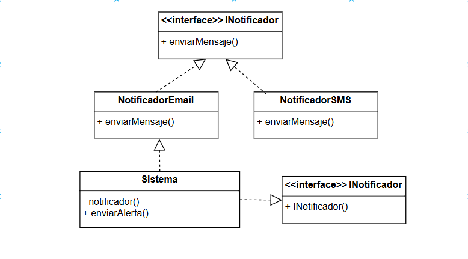

# Principio de Inversión de Dependencias (DIP)

## Propósito y Tipo del Principio SOLID

El Principio de Inversión de Dependencias (DIP) establece que, los módulos de alto nivel no deben depender de los módulos de bajo nivel. Ambos deben depender de abstracciones y las abstracciones no deben depender de los detalles, sino que los detalles deben depender de las abstracciones.

En el sistema de turnos médicos, esto permite que clases como Sistema, Recepcionista, Paciente, o Médico puedan interactuar entre sí a través de interfaces, evitando acoplamientos directos y facilitando el mantenimiento, las pruebas unitarias y futuras extensiones.

---

## Motivación

En una versión inicial del sistema, el módulo Sistema podría estar directamente acoplado a clases concretas como Paciente, Médico o incluso NotificadorEmail para enviar notificaciones. Esto genera alta dependencia entre las clases, dificultando los cambios. Por ejemplo, si se quisiera cambiar de email a SMS o agregar notificaciones push, habría que modificar la clase Sistema.

Gracias al DIP, Sistema puede depender de una interfaz como INotificador, y cualquier tipo de notificador (por email, SMS, etc.) podrá ser implementado sin modificar Sistema.

Ejemplo del mundo real: Supongamos que el Sistema debe enviar notificaciones de turno a pacientes. Si el Sistema depende directamente de la clase concreta NotificadorEmail, entonces cualquier cambio al método de notificación implicaría cambiar la lógica del Sistema.

En cambio, si Sistema depende de una interfaz abstracta, como INotificador, y se inyecta un objeto concreto (como NotificadorEmail o NotificadorSMS), entonces podemos cambiar el comportamiento sin modificar Sistema.

---

## Aplicación del Principio DIP en las Clases del Proyecto

En el sistema de gestión de turnos médicos, se aplica el Principio de Inversión de Dependencias (DIP) al introducir interfaces (abstracciones) que permiten desacoplar clases de alto nivel de clases de bajo nivel.

Por ejemplo, en lugar de que la clase Sistema dependa directamente de una implementación concreta como NotificadorEmail, se define una interfaz INotificador que abstrae el comportamiento de envío de mensajes. De esta forma, Sistema puede funcionar con cualquier clase que implemente esa interfaz, como NotificadorEmail, NotificadorSMS, o NotificadorPush.

Este principio también podría aplicarse en otros contextos del sistema, como el almacenamiento de datos (IRepositorioTurnos), permitiendo que se pueda cambiar fácilmente entre una base de datos local, un archivo o una API externa, sin modificar el módulo principal del sistema.

Beneficios observados:
- Reducción del acoplamiento entre módulos.
- Mayor facilidad de mantenimiento y extensión.
- Facilidad para realizar pruebas unitarias, ya que se pueden simular las implementaciones con mocks.
- Aplicación efectiva de la inyección de dependencias, facilitando el control desde fuera de la clase.

---

## Estructura de Clases (UML)

A continuación se muestra el diagrama UML con la separación de responsabilidades aplicada según el DIP.

