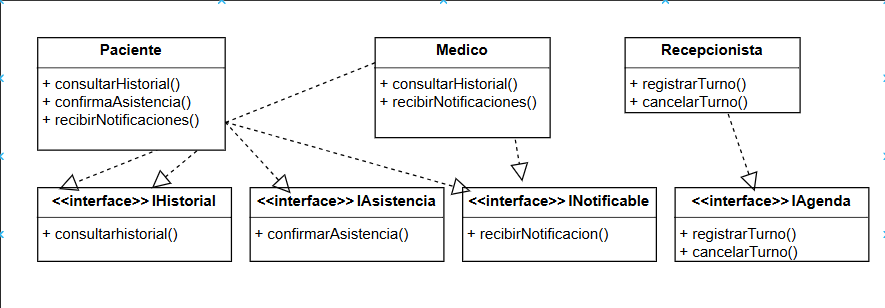

# Principio de Segregación de Interfaces (ISP)

## Propósito y Tipo del Principio SOLID

El Principio de Segregación de Interfaces (ISP) establece que los clientes no deben estar obligados a depender de interfaces que no utilizan. Es decir, las clases no deberían verse forzadas a implementar métodos que no les competen. Este principio favorece interfaces específicas frente a interfaces generales, promoviendo un diseño más claro, flexible y mantenible.

---

## Motivación

En la versión original, podríamos tener una interfaz genérica IUsuario con métodos como consultarHistorial(), registrarTurno(), cancelarTurno(), confirmarAsistencia() y recibirNotificacion(). Esto obliga a todos los roles (Paciente, Médico, Recepcionista) a implementar o ignorar métodos que no les competen:
 - El Paciente no necesita registrarTurno() ni cancelarTurno().
 - El Recepcionista no necesita consultarHistorial() ni confirmarAsistencia().
 - El Médico no necesita registrarTurno() ni cancelarTurno() ni confirmarAsistencia().
Este acoplamiento innecesario complica el mantenimiento y la evolución de la interfaz.

Ejemplo del mundo real: Imaginá que todos los empleados de un hospital tuvieran que llenar el mismo formulario para reportar sus tareas. Una enfermera tendría que escribir sobre turnos de cirugía y un recepcionista sobre medicación, cosas que no tienen sentido para su rol. Lo ideal sería que cada uno reciba un formulario con campos específicos para su función.

---

## Aplicación del Principio ISP en las Clases del Proyecto

Para cumplir con el ISP, se pueden definir interfaces específicas y claras para cada tipo de usuario:
Clases que implementan las interfaces:

- Interfaz IHistorial: Solo define la consulta de historial, para Paciente y Médico.
- Interfaz IAgenda: Solo define operaciones de agenda, para Recepcionista.
- Interfaz IAsistencia: Solo define confirmación de asistencia, para Paciente.
- Interfaz INotificable: Solo define recepción de notificaciones, para Paciente y Médico.

Clases que implementaria:
- Paciente implementa IHistorial, IAsistencia, INotificable
- Médico implementa IHistorial, INotificable
- Recepcionista implementa IAgenda
Cada clase depende únicamente de los métodos que realmente utiliza.

Justificación de diseño
- Paciente: puede consultar su historial, confirmar asistencia y recibir notificaciones. No se ve forzado a métodos de agenda.
- Médico: consulta historial y recibe notificaciones de cambios de turno; no registra ni cancela citas.
- Recepcionista: gestiona exclusivamente la creación y cancelación de turnos.
Esta segregación mejora la claridad y facilita añadir nuevas operaciones específicas sin alterar interfaces existentes.

---

## Estructura de Clases (UML)

A continuación se muestra el diagrama UML con la separación de responsabilidades aplicada según el ISP.

