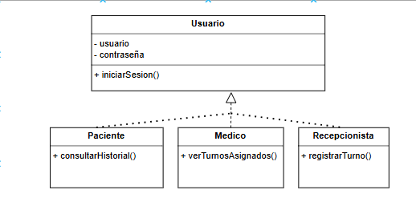

# Principio de Sustitución de Liskov (LSP)

## Propósito y Tipo del Principio SOLID

El Principio de Sustitución de Liskov (LSP) establece que una clase derivada debe poder sustituir a su clase base sin alterar el comportamiento esperado del programa. Es un principio de herencia y comportamiento polimórfico, que asegura la coherencia funcional entre superclases y subclases.
En nuestro sistema de turnos médicos, aplicamos este principio asegurando que las clases derivadas como Paciente, Médico y Recepcionista puedan usarse en cualquier contexto donde se espera un Usuario, sin romper la lógica del sistema.

---

## Motivación

Inicialmente, la clase Usuario se utilizaba como clase base, pero al incorporar funciones específicas para Paciente (como consultar su historial) o Recepcionista (como registrar un turno), se volvió necesario extenderla adecuadamente.

El problema surgía cuando métodos definidos en la clase base no eran aplicables a todas las subclases, lo cual violaba el contrato esperado. Por ejemplo, si Recepcionista heredaba un método consultarHistorial() de Usuario pero no lo utilizaba, el sistema podría arrojar errores o tener un comportamiento inconsistente.

Ejemplo del mundo real
Pensá en un sistema de gestión de vehículos donde Vehículo es la clase base, y Auto y Bicicleta son subclases. Si Vehículo tiene un método recargarCombustible(), este método no puede aplicarse a Bicicleta sin romper el sistema. Algo similar pasaba en nuestro modelo de usuarios.

---

## Aplicación del Principio LSP en las Clases del Proyecto

Para cumplir con LSP:
Se creó una jerarquía clara donde Usuario define solo métodos comunes.
Las subclases (Paciente, Médico, Recepcionista) implementan sus propios métodos sin alterar la lógica de Usuario.
Cada instancia de una subclase puede usarse como Usuario sin producir errores inesperados.

---

## Estructura de Clases (UML)

A continuación se muestra el diagrama UML con la separación de responsabilidades aplicada según el LSP.

