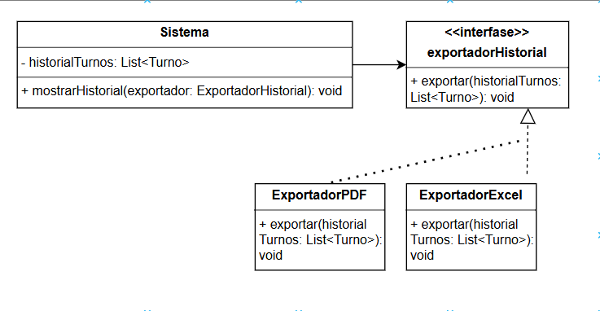

# Principio de Abierto Cerrado (OCP)

## Propósito y Tipo del Principio SOLID

El Principio de Abierto/Cerrado (Open/Closed Principle) establece que las entidades del software (clases, módulos, funciones) deben estar abiertas a la extensión pero cerradas a la modificación. Es decir, se debe poder agregar nueva funcionalidad al sistema sin modificar el código existente. Esto previene errores en funcionalidades ya implementadas y favorece la escalabilidad.

---

## Motivación

Inicialmente, en el sistema de gestión de turnos médicos, cada vez que se agregaba una nueva funcionalidad relacionada con la visualización de turnos (por ejemplo, nuevos filtros, formatos de visualización o exportaciones), era necesario modificar directamente la clase Sistema o Turno. Esta situación violaba el OCP porque obligaba a tocar código ya probado y utilizado, lo que podía generar errores no deseados o comprometer la estabilidad general del sistema.

Ejemplo del mundo real:
Supongamos que queremos permitir exportar el historial de turnos en diferentes formatos (PDF, Excel, JSON). Si modificamos la clase Sistema cada vez que incorporamos un nuevo tipo de exportación, rompemos el principio. En su lugar, podemos definir una interfaz ExportadorHistorial que permita crear nuevas clases para cada tipo de exportación sin modificar el código existente.

Gracias al uso del OCP, ahora se pueden agregar nuevos tipos de exportación del historial de turnos sin alterar el núcleo del sistema, simplemente implementando nuevas clases que cumplan con la interfaz esperada.

---

## Aplicación del Principio OCP en las Clases del Proyecto

### Clase: Sistema
- **Responsabilidad**: Mostrar el historial de turnos y permitir su exportación.
- **Aplicación del OCP**: En lugar de tener múltiples métodos dentro de la clase para exportar en distintos formatos, delega esa tarea a clases externas que implementan una interfaz ExportadorHistorial.
- **Ventaja**: Se pueden agregar nuevos formatos de exportación (por ejemplo, ExportadorCSV, ExportadorXML) sin modificar la clase Sistema, lo que evita la regresión de errores.

### Interfaz ExportadorHistorial
- **Responsabilidad**: Define un método común exportar(historialTurnos) que será implementado por distintas clases de exportación.
- **Aplicación del OCP**: La interfaz permite extender la funcionalidad de exportación sin cambiar el contrato existente. Cada nuevo exportador respeta el contrato y agrega valor sin romper el código anterior.

### Clases: ExportadorPDF, ExportadorExcel
- **Responsabilidad**: Implementan la lógica específica para exportar los datos del historial en el formato correspondiente.
- **Aplicación del OCP**: Estas clases implementan la interfaz ExportadorHistorial, y se integran al sistema sin necesidad de modificar el resto del código.

---

## Estructura de Clases (UML)

A continuación se muestra el diagrama UML con la separación de responsabilidades aplicada según el ORP.

