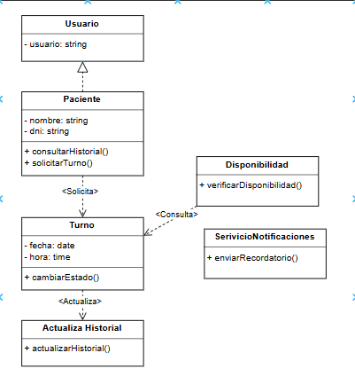

# Principio de Responsabilidad Única (SRP)

## Propósito y Tipo del Principio SOLID

El Principio de Responsabilidad Única (Single Responsibility Principle) indica que una clase debe tener una única razón para cambiar, es decir, debe tener una única responsabilidad dentro del sistema. Este es un **principio de diseño de clases** que promueve una estructura de código modular, fácil de mantener y escalar.

Aplicando este principio, las clases evitan mezclar diferentes lógicas de negocio, lo que facilita su comprensión y reduce la posibilidad de errores al modificar una funcionalidad específica.

---

## Motivación

Durante el análisis inicial del sistema, se detectó que ciertas clases, como `Paciente` o `Sistema`, tendían a concentrar múltiples funciones: desde mostrar interfaces hasta manejar lógica de turnos o notificaciones. Esta sobrecarga de responsabilidades complicaba las pruebas y la reutilización del código, generando un alto acoplamiento entre funcionalidades.

Por ejemplo, si el método de envío de notificaciones cambiaba (de correo a WhatsApp), también debía modificarse la clase `Paciente`, lo que no es deseable.

**Ejemplo del mundo real:**  
Pensemos en una impresora multifunción. Si una sola clase maneja impresión, escaneo y envío de fax, cualquier cambio en la funcionalidad de escaneo podría afectar la impresión, aunque no estén directamente relacionadas. Aplicar SRP implicaría separar esas funcionalidades en clases distintas como `Impresora`, `Escáner` y `Fax`, cada una con su única responsabilidad.

---

## Aplicación del Principio SRP en las Clases del Proyecto

### Clase: `Paciente`
- **Responsabilidad única**: Gestionar los datos del paciente y su historial de turnos.
- **Mejora**: Se evita que tenga lógica de gestión de turnos o notificaciones, que ahora corresponde al `Sistema`.

### Clase: `Turno`
- **Responsabilidad única**: Administrar el estado y la asignación de un turno.
- **Mejora**: No tiene lógica de envío de mensajes o validaciones externas.

### Clase: `Sistema`
- **Responsabilidad única**: Coordinar funcionalidades del sistema, como búsquedas, notificaciones y visualización de datos.
- **Mejora**: Centraliza tareas de coordinación, sin apropiarse de responsabilidades específicas de los actores del sistema.

---

## Estructura de Clases (UML)

A continuación se muestra el diagrama UML con la separación de responsabilidades aplicada según el SRP.

